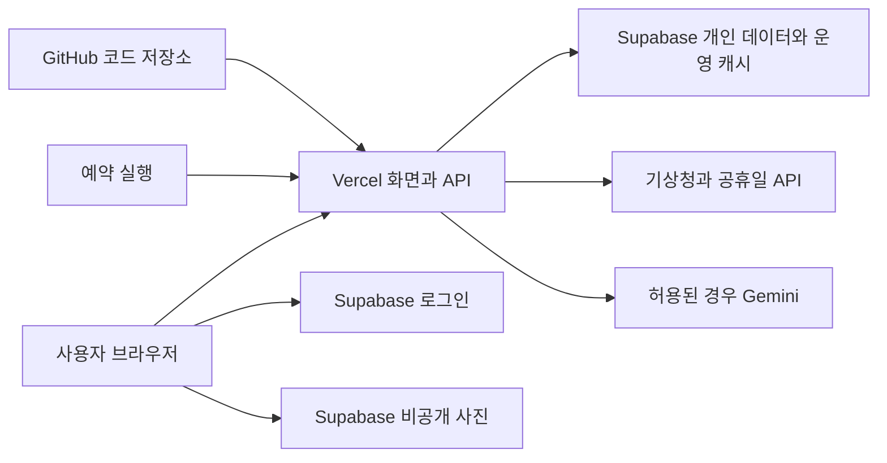

# GitHub에서 Vercel로 배포하는 구조

기준일 2026-10-08. 사용자가 GitHub에 코드를 올리고 저장소를 Vercel에 연결하는 방식을 기준으로 합니다. **v24는 로컬 구현본이며 아래 배포 변경이 아직 필요합니다.**

## 역할 배치

GitHub는 소스 보관, Vercel은 화면과 요청 처리, Supabase는 계정·데이터·사진을 담당합니다. GitHub 업로드만으로 브라우저의 옷장이나 서버 캐시가 옮겨지지 않습니다.

## 필요한 코드 변경

| 현재 v24 | 배포판에 필요한 변경 |
| --- | --- |
| server.mjs의 HTTP listen·타이머 | 요청마다 호출되는 Node.js Function 진입점으로 분리 |
| 현재 폴더의 .env 또는 실행 환경변수 | Vercel 환경변수에서 읽기. 로컬 개발만 선택적 .env |
| 파일 예보·공휴일 | Supabase 공유 캐시 및 발표/지역별 중복 제어 |
| 파일 예산·프로세스 잠금 | DB 트랜잭션과 호출 고유 키로 공동 예산 제어 |
| 메모리 재사용/동시 요청 묶기 | 짧은 캐시 보조로만 사용. 여러 인스턴스의 비용 제어는 DB |
| 사진 요청 본문·이미지 응답 | 비공개 Storage 직접 전송, API에는 mediaId 전달 |
| 로컬/LAN Host 허용 | 확정된 운영·시험 Origin 검증. 사용자 Host를 무조건 신뢰하지 않음 |
| 공개 로컬 API | 인증·소유권·요청 제한 적용, 운영 기록은 서버 전용 |
| 잠금 파일로 독립 설치 | Vercel 새 환경의 배포 번들 검증 |

Function은 요청을 처리하는 동안 실행되는 서버 코드입니다. 요청 종료 후 setInterval로 계속 수집되리라 기대하거나 로컬 파일을 영구 공용 저장소로 사용하지 않습니다. 계산 모듈은 재사용하고 저장/실행 진입점을 바꿉니다.

## 사진과 배경 제거

Vercel Function 요청·응답 본문 제한은 4.5MB입니다. 기존 10MB 분석 파일을 base64로 본문에 넣는 방식은 유지할 수 없습니다. 파일은 Storage에 직접 올리고 서버는 소유권 확인된 mediaId로 원본을 읽어 분석 공급자에 전달합니다. 응답은 속성 JSON 또는 저장 경로만 반환합니다. [Vercel 제한](https://vercel.com/docs/functions/limitations)

기존 IMG.LY 배경 제거는 네이티브 의존성과 모델 파일이 있으므로 번들 크기·메모리·첫 실행·처리시간을 측정해야 합니다. 맞으면 Node Function에서 처리하고, 맞지 않으면 별도 작업 실행 환경으로 분리합니다. Vercel에서 무조건 불가능하다고 단정하지 않으며, 검증 없이 패키지만 그대로 올리지도 않습니다. 이 선택 기능의 호환 검증은 새 누끼 룩북 개발과 별개입니다.

## 날씨 예약 수집

기상청 발표 02/05/08/11/14/17/20/23시의 15분 뒤에 활성 지역을 수집합니다. 같은 격자는 한 번만 요청하고, job_runs에서 동일 발표 작업의 중복을 막습니다. 일부 실패는 기존 유효 데이터를 보존하고 다음 회차 또는 제한된 재시도로 보완합니다.

Vercel Hobby Cron은 작업당 하루 한 번과 시간 단위 실행 제약이 있어 기존 3시간 간격 수집의 기본 수단으로 맞지 않습니다. 기본안은 Supabase Cron에서 인증된 수집 API를 호출하는 방식입니다. Pro Vercel Cron은 계정/비용을 확인한 뒤 대안으로 사용할 수 있습니다. [Vercel Cron 제약](https://vercel.com/docs/cron-jobs/usage-and-pricing), [Supabase Cron](https://supabase.com/docs/guides/cron)

공휴일은 현재/다음 연도를 하루 단위로 갱신합니다. 스케줄 비밀값은 서버/예약 실행의 비밀 보관에만 두며, 웹 방문자가 임의로 수집·비용 발생을 반복할 수 없게 합니다. 시험 배포와 운영 배포에 같은 예약을 중복 등록하지 않습니다.

## 환경변수

환경변수는 실행할 때 읽는 설정값입니다. 실제 값은 GitHub에 올리지 않고 Vercel의 환경별 설정에 입력합니다.

| 이름 | 현재/예정 | 용도 |
| --- | --- | --- |
| SUPABASE_URL | 현재 | 선택한 프로젝트 HTTPS 주소 |
| SUPABASE_PUBLISHABLE_KEY | 현재 | 일반 사용자 API용 공개 키. secret/service_role 대입 금지 |
| CLOSET_STORAGE_MODE | 현재 | 원격 준비 완료 후 supabase. 현재 로컬은 local |
| KMA_PROVIDER | 현재 | data 등 사용 중인 공급 경로 |
| KMA_SERVICE_KEY | 현재, 서버 비밀 | 기상청 사용 인증 |
| KASI_SERVICE_KEY | 현재, 서버 비밀 | 공휴일 API 인증. 공공데이터 경로의 키 재사용 가능 여부와 서비스 권한 별도 확인 |
| GEMINI_API_KEY | 현재, 서버 비밀 | AI 활성화 시에만 사용 |
| CLOSET_ENABLE_GEMINI | 현재 | Preview는 0. 활성화는 검증 후 별도 |
| CLOSET_TEST_MODE | 현재 | 1이면 Gemini와 배경 작업을 끔. 모든 네트워크를 자동 차단하는 값은 아님 |
| CLOSET_ENABLE_OBSERVATIONS | 현재 | 관측 온습도 선택 활성화. 미설정은 실측으로 표시하지 않음 |
| APP_ORIGIN / ALLOWED_ORIGINS | 추가 예정 | 확정된 운영/시험 주소 목록, 공개 호스트 검증 |
| CRON_SECRET | 추가 예정 | 예약 수집 인증 |
| SUPABASE_SERVER_SECRET | 필요 시 추가 예정 | 운영 전용 DB 경로. 일반 옷장 어댑터와 분리 |
| AI_BUDGET_KEY | 추가 예정 | 이전한 공동 예산 원장 식별자 |

Preview와 Production은 데이터/예산/예약 작업을 분리합니다. 가능하면 시험용 Supabase 프로젝트를 별도로 쓰고, 같은 프로젝트면 시험 계정과 접근 규칙을 명확히 구분합니다. Preview에는 실제 Gemini 키를 주지 않는 방식을 우선합니다.

## GitHub 연결 이후 설정 순서

1. 배포용 사본의 빌드가 public 파일 허용목록과 API 진입점을 만들도록 구현합니다. 현재 package.json에는 build가 없으므로 존재하지 않는 명령을 설정하지 않습니다.
2. 새 배포판의 제안 명령은 npm run build, 정적 출력은 public입니다. scripts/build를 구현·검증한 뒤 적용합니다. 정리된 앱 폴더 내용만 GitHub 저장소 최상위에 올리고 워크샵 자료는 포함하지 않습니다.
3. GitHub 저장소를 Vercel 프로젝트에 연결합니다. Node 런타임 버전은 잠금 파일과 네이티브 패키지의 새 환경 시험으로 확정합니다.
4. Preview용 설정을 넣고 첫 배포를 만듭니다. /api/config의 공개 응답·로그인·옷장·사진·가상 추천을 점검합니다.
5. Supabase Auth의 허용 주소와 이메일 확인/복구 돌아오기 주소를 실제 배포 주소에 맞춥니다. 임의의 모든 주소를 허용하지 않습니다.
6. 두 계정의 접근 차단, 데이터 이전, 예약 수집, 공동 예산을 검증한 후 Production으로 전환합니다. 유료 모델 활성화는 그 뒤 별도 단계입니다.

현재 로그인은 메모리 세션이며 자동 장기 로그인/완전한 갱신 흐름이 아닙니다. 첫 배포에서는 공식 Auth 클라이언트의 메모리 세션+열려 있는 동안 갱신을 구현하고 새로고침 시 재로그인을 명시하는 안으로 시작합니다. 비밀번호를 브라우저 저장소에 저장하지 않습니다. 로그인 유지 기능을 추가할 때 별도로 검토합니다.

## 비용과 운영

추천 조합/색/두께 계산 자체는 모델 호출이 없습니다. 최초 후보 팁에만 제한된 텍스트를 보내고 버튼 조정에서는 호출하지 않는 정책을 유지합니다. 이미지 저장 용량·읽기 전송량·예약 API·Function 실행·AI 사용량을 별도로 관측합니다. 현재 사용자의 요금제/사용량을 확인하지 않았으므로 무료 운영을 보장하거나 유료 업그레이드를 전제로 삼지 않습니다.

실제 요금과 한도는 배포 시 계정 설정으로 재확인합니다. 코드 업로드, 서비스 연결, SQL 적용, 실제 데이터 이전은 각각 완료 확인이 필요한 별도 단계입니다.

